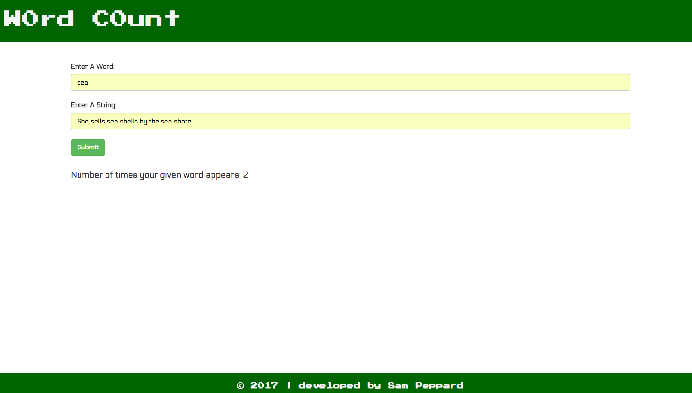

# W0rd C0unt

a project built with PHP, Silex, PHPUnit, Twig and Bootstrap
#
##### By [Sam Peppard](https://github.com/sampeppard)
#

## Description

An app that returns the frequency count of a given word given a string

----
### **Specifications**
| _Behavior_ | _Input_ | _Output_ |
|:---------------------------------------------------------------------:|:---------------------------------------------------------------------------:|:-------------------------------------------------------------------------------------------------------------------:|
| Return false for non-alphabetical characters | 123 | False |
| Return number of instances of an input word that appears in a given string | apple, "The apple grows on the apple tree." | 2 |

## Setup/Installation Requirements

* Clone this repository
* If editing, open project directory in Code Editor of choice
* If viewing, open your command prompt, type composer install, enter php -S localhost:8000 and type localhost:8000 in your browser address bar to view the application

## Known Bugs

No known bugs.

## Support and contact details

For comments or questions, please email sampeppard@gmail.com

## Technologies Used

* HTML
* CSS
* PHP
* PHPUnit
* Silex
* Twig
* Bootstrap version 3.3.7.

----
## Heroku Link

https://sp-word-count.herokuapp.com/

### License

*This application is licensed under the MIT license*

Copyright (c) 2016 **Samuel Peppard**
